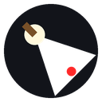

<div align="center">
  
  
  # Socket
  
  ### *Others load. Socket unloads.*
  
  <br>
  
  
  
  
  
  
  
  
  <br>
  
  
  
  
  
  <br><br>
  
  > **Transform any webpage into an interactive arcade playground.** Illuminate dark corners with a dynamic torch, pilot a fighter ship through destructible elements, or battle waves of enemies in a standalone gaming arena—all powered by pure vanilla JavaScript and Canvas.
  
</div>

---

## 🌟 What is Socket?

<table>
<tr>
<td width="50%">

**A Manifest V3 Browser Extension** that transforms ordinary webpages into interactive playgrounds. Toggle between three powerful modes:

- 🔦 **Torch Mode** — Illuminate the darkness with a warm spotlight that follows your cursor
- 🚀 **Shooter Mode** — Pilot a fighter and destroy destructible webpage elements
- ⚔️ **Combat Arena** — Epic standalone arcade game with 10-wave enemy campaign

</td>
<td width="50%">

**Zero Compromise. Zero Dependencies.**

- Pure vanilla JavaScript
- Native Canvas & Web Audio API
- No external libraries
- No external asset loads
- Lightning-fast performance
- ~30KB total size

</td>
</tr>
</table>

---

## ✨ Features

### 🔦 Torch Mode — Illuminate The Darkness

<table>
<tr>
<td width="60%">

Plunge any webpage into shadow and light with a dynamic torch overlay. Your cursor becomes a warm, radiant spotlight cutting through an 85% black overlay.

**Key Features:**
- 🌊 **Organic Flicker** — Real-time flame flicker using non-periodic sine wave synthesis
- 🎚️ **Dynamic Resize** — Scroll to adjust spotlight radius from 30px to 400px
- 🎯 **Smooth Tracking** — Spotlight follows cursor naturally across the page

**Controls:**
| Action | Key |
|--------|-----|
| Toggle Torch | `T` |
| Resize Spotlight | `Scroll Up/Down` |

</td>
<td width="40%" align="center">

```
Press T to activate
┌─────────────────┐
│  ░░░░░░░░░░░░░  │
│ ░░░░░░░░░░░░░░░ │
│ ░░░░ ◉ ░░░░░░░ │
│ ░░░░░░░░░░░░░░░ │
│  ░░░░░░░░░░░░░  │
└─────────────────┘
```

</td>
</tr>
</table>

---

### 🚀 Shooter Mode — Destroy & Explode

<table>
<tr>
<td width="40%" align="center">

```
Pilot a fighter ship
    ▲
   ◄►
    ▼

W/A/S/D to move
Space to fire
B to scan
```

</td>
<td width="60%">

Pilot a nimble fighter ship and annihilate destructible webpage elements. Features Asteroids-style physics and devastating particle effects.

**Combat System:**
- ⚔️ **3 Weapon Types** — Single Shot | Spread Shot | Bomb
- 🛡️ **Dynamic HP System** — Elements have durability based on screen size
- ✨ **Explosive Effects** — Shattering polygonal shards with physics & particles
- 🎯 **Smart Targeting** — Avoids layout wrappers, targets content

**Element Durability:**
| Size | HP |
|------|-----|
| Small (< 15K px²) | 1 HP |
| Medium (< 60K px²) | 2 HP |
| Large (≥ 60K px²) | 4 HP |

**Controls:**
| Action | Key |
|--------|-----|
| Toggle Shooter | `F` |
| Move Ship | `W/A/S/D` |
| Fire Weapon | `Space` |
| Switch Weapon | `1/2/3` |
| Target Scan | `B` |
| Launch Combat Arena | `C` |

</td>
</tr>
</table>

---

### ⚔️ Combat Arena — Wave-Based Campaign

<table>
<tr>
<td width="60%">

A standalone, high-octane arcade game. Battle 10 waves of increasingly challenging AI fleets—from nimble Scouts to massive Bosses. Survive and claim victory with style.

**Wave Progression:**
- 🌊 **10 Enemy Waves** — Escalating difficulty with diverse enemy types
- 👾 **Enemy Variety** — Drones, Scouts, Cruisers, Bombers, Support Ships, Bosses
- 🎖️ **High Score Tracking** — Persisted leaderboard in local storage
- 🎮 **Arcade HUD** — Score, wave counter, radar, combo system

**Enemy Types:**

| Enemy | Role | Special Ability |
|-------|------|-----------------|
| **Drone** | Cannon fodder | Basic attacks |
| **Scout** | Fast striker | High agility |
| **Cruiser** | Balanced threat | Heavy fire |
| **Bomber** | Area damage | Large bombs |
| **Support Ship** | Healer role | Shields nearby allies |
| **Boss** | Final challenge | Massive HP + patterns |

**Power-up System:**

| Power-up | Color | Effect | Duration |
|----------|-------|--------|----------|
| 🛡️ Shield | Cyan | Deflection barrier | 10s |
| 🔥 Triple Shot | Red | 3-line laser | 8s |
| ⚡ Engine Overdrive | Green | 2x handling & accel | 8s |

**Controls:**
| Action | Key |
|--------|-----|
| Launch/Thrust | `W` |
| Rotate | `A/D` |
| Brake/Reverse | `S` |
| Fire | `Space` |
| Switch Weapon | `1/2/3` |
| Toggle Music | `M` |
| Replay/Restart | `R` |
| Exit Game | `C/Esc` |

</td>
<td width="40%" align="center">

```
╔═══════════════════╗
║  COMBAT ARENA     ║
║  ═════════════    ║
║   Wave: 10/10     ║
│   Score: 50,000   ║
║                   ║
║       ⚔️         ║
║      👾 👾 👾    ║
║    👾   👾   👾  ║
║                   ║
║   [Shield] [🔥]   ║
╚═══════════════════╝
```

</td>
</tr>
</table>

---

### 🎛️ HUD & Immersive Systems

<table>
<tr>
<td>

**Top-Left Panel** (Score & Wave)
- Current Score
- High Score (persisted)
- Wave Status (1-10 / FINAL)
- Progress bar of defeated enemies

</td>
<td>

**Top-Right Panel** (System Status)
- 🔊 Music mute indicator
- ⏱️ Active power-up timers
- 📊 Real-time system info

</td>
<td>

**Bottom-Left Panel** (Radar)
- Active radar sweep
- Player position (Cyan dot)
- Power-ups (colored blips)
- Enemies (Red/Purple/Magenta)

</td>
<td>

**Bottom-Right Panel** (Combo)
- Active combo multiplier
- Yellow decay bar
- Resets after 1.5s idle

</td>
</tr>
</table>

---

## ⌨️ Complete Keyboard Reference

<div align="center">

### 🌐 Webpage Mode

| Key | Action | Context |
|:---:|:---|:---|
| `T` | 🔦 Toggle Torch | Anytime |
| `F` | 🚀 Toggle Shooter | Anytime |
| `B` | 🎯 Toggle Target Scan | Shooter ON |
| `C` | ⚔️ Launch Combat Arena | Shooter ON |
| `W / S` | ⬆️ Thrust / Decelerate | Shooter ON |
| `A / D` | ⬅️ Rotate Left / Right | Shooter ON |
| `Space` | 🔫 Fire Weapon | Shooter ON |
| `1 / 2 / 3` | Switch Weapon | Shooter ON |
| `Scroll ↑/↓` | Adjust Spotlight Size | Torch ON |
| `Esc` | Exit active mode | Active |

### 🎮 Combat Arena Mode

| Key | Action | Context |
|:---:|:---|:---|
| `W / A / S / D` | ⬆️⬅️⬇️➡️ Move Ship | Gameplay |
| `Space` | 🔫 Fire Weapon | Gameplay |
| `1 / 2 / 3` | Switch Weapon | Gameplay |
| `M` | 🔊 Toggle Music | Gameplay |
| `R` | 🔄 Replay Game | Victory |
| `C / Esc` | 🚪 Exit Game | Anytime |
| `Click / Any Key` | 🚀 Launch Ship | Start Screen |

**Note:** Keyboard inputs are safely ignored when typing in webpage text fields.

</div>

---

## 🎯 Weapon Arsenal

<table>
<tr>
<td width="33%">

### 1️⃣ Single Shot
**Default Weapon**

High-velocity laser with white core and yellow-orange trail.

- Fast rate of fire
- Precision targeting
- Instant hit

**Best for:** Accuracy

</td>
<td width="33%">

### 2️⃣ Spread Shot
**Wide Coverage**

3-way fan pattern with ±15° spread angle for area coverage.

- Covers wider area
- Lower single-hit damage
- Chaotic destruction

**Best for:** Groups

</td>
<td width="33%">

### 3️⃣ Bomb
**Area Destruction**

Heavy energy bomb with explosive blast radius.

**Webpage Mode:**
- 150px blast radius
- 4 damage on impact
- 2.0s cooldown

**Combat Arena:**
- 180px blast radius
- 4 damage + knockback
- 1.8s cooldown

**Best for:** Bosses

</td>
</tr>
</table>

---

## 🎵 Sound Design — Pure Web Audio API

All audio is procedurally generated using browser synthesizers. No external samples.

<table>
<tr>
<td>

**⚡ Interaction Sounds**
- `Click` — Mode toggle chime
- `Pew` — Weapon fire sweep
- `Boom` — Destruction thump
- `Clank` — Element hit

</td>
<td>

**🎖️ Victory Sounds**
- `Chime` — Power-up collected
- `Deflect` — Shield absorbs hit
- `Enemy Shoot` — Enemy fire
- `Fanfare` — Boss defeated

</td>
<td>

**🎶 Ambient**
- `Music Beat` — Walking bass soundtrack (A1/C2/D2/G1)
- `Victory Fanfare` — Wave 10 Boss defeated

</td>
</tr>
</table>

---

## ⚙️ Advanced Configuration

### 📊 Webpage Mode Tuning (`content.js`)

| Parameter | Value | Purpose |
|-----------|-------|---------|
| `DEFAULT_RADIUS` | 120 px | Starting torch size |
| `MIN_RADIUS` | 30 px | Smallest spotlight |
| `MAX_RADIUS` | 400 px | Largest spotlight |
| `RADIUS_STEP` | 15 px | Per-scroll change |
| `TORCH_FLICKER` | 0.025 | Flicker intensity |
| `BULLET_SPEED` | 22 px/frame | Shot velocity |
| `BOMB_SPEED` | 7 px/frame | Bomb velocity |
| `SPREAD_ANGLE` | 15° | Fan width |
| `BOMB_BLAST_RADIUS` | 150 px | Explosion size |
| `BOMB_COOLDOWN_MS` | 2000 ms | Recharge time |
| `SHIP_SIZE` | 16 px | Triangle radius |
| `ROTATION_SPEED` | 3.8 rad/s | Turn speed |
| `THRUST_ACCEL` | 550 px/s² | Acceleration |
| `MAX_SPEED` | 500 px/s | Speed cap |
| `DRAG` | 0.982 | Friction factor |

### 🎮 Combat Arena Tuning (`game.js`)

| Parameter | Value | Purpose |
|-----------|-------|---------|
| `SHIP_SIZE` | 20 px | Triangle radius |
| `ROTATION_SPEED` | 4.2 rad/s | Turn speed |
| `THRUST_ACCEL` | 650 px/s² | Acceleration |
| `MAX_SPEED` | 550 px/s | Speed cap |
| `DRAG` | 0.985 | Friction factor |
| `BULLET_SPEED` | 24 px/frame | Shot velocity |
| `BOMB_SPEED` | 8 px/frame | Bomb velocity |
| `BOMB_BLAST_RADIUS` | 180 px | Explosion size |
| `BOMB_COOLDOWN_MS` | 1800 ms | Recharge time |
| `SPREAD_ANGLE` | 15° | Fan width |

---

## 🚀 Quick Start

<div align="center">

### Installation Guide

</div>

Socket installs as an unpacked developer extension in Chromium browsers:

<table>
<tr>
<td width="50%">

**Step 1:** Open Extension Manager
```
Navigate to: chrome://extensions
```

**Step 2:** Enable Developer Mode
```
Toggle "Developer mode" (top-right corner)
```

</td>
<td width="50%">

**Step 3:** Load Extension
```
Click "Load unpacked"
Select this directory
```

**Step 4:** Start Playing
```
Open any webpage
Press T, F, or C
```

</td>
</tr>
</table>

---

## 💡 Tips & Tricks

<table>
<tr>
<td>

### 🔦 Torch Mode Pro Tips
- Adjust spotlight size with scroll wheel for dramatic effects
- Combine with Shooter Mode for immersive gameplay
- Works on any webpage instantly

</td>
<td>

### 🚀 Shooter Mode Pro Tips
- Use **B** to highlight destructible elements
- Large elements require more hits
- Bombs bypass durability caps
- Long pages are scrollable

</td>
<td>

### ⚔️ Combat Arena Pro Tips
- Collect power-ups for strategic advantage
- Watch the radar in bottom-left
- Combo multiplier = extra points
- Save high scores automatically

</td>
</tr>
</table>

---

## 📊 Project Stats

<div align="center">

| Metric | Value |
|--------|-------|
| **Total Size** | ~30 KB |
| **Dependencies** | 0 |
| **Lines of Code** | 2500+ |
| **Canvas Objects** | 200+ per frame |
| **Audio Voices** | 8 concurrent |
| **Supported Browsers** | Chrome, Edge, Brave, Chromium |
| **Performance Target** | 60 FPS |

</div>

---

## 📝 License

Socket is released under the **MIT License**. Feel free to use, modify, and distribute.

---

## 🤝 Contributing

Have ideas to make Socket even better?

- **Found a bug?** Open an issue
- **Want to add features?** Submit a pull request
- **Design suggestions?** We'd love to hear them!

---

<div align="center">

### Made with ❤️ by the Socket Team

**Transform the web. One click at a time.**

[⬆ Back to Top](#-socket)

</div>
